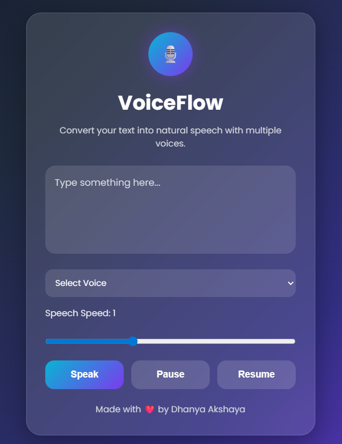

# 🎙️ VoiceFlow – Text to Speech Web App

VoiceFlow is a modern and responsive Text-to-Speech web application built using HTML, CSS, and JavaScript.

It converts typed text into natural speech using the browser’s built-in SpeechSynthesis API. The application includes multiple voice selection, speech speed control, and pause/resume functionality with a modern glassmorphism user interface.

---

# 🚀 Live Demo

🔗 https://your-username.github.io/voiceflow/

> Replace the above link with your deployed GitHub Pages link.

---

# ✨ Features

- 🔊 Convert text into speech instantly
- 🎤 Multiple voice selection
- ⚡ Adjustable speech speed
- ⏸ Pause speech anytime
- ▶ Resume speech from paused position
- 📱 Fully responsive design
- 🎨 Modern glassmorphism UI
- 🌈 Animated gradient background
- 💻 Built using pure frontend technologies

---

# 🛠️ Technologies Used

- HTML5
- CSS3
- JavaScript
- SpeechSynthesis API
- Google Fonts (Poppins)

---

# 📸 Screenshot



> Upload your screenshot file in the same GitHub repository and name it:
>
> ```bash
> screenshot.png
> ```

---

# 📂 Project Structure

```bash
VoiceFlow/
│
├── index.html
├── README.md
└── vf.png
```

---

# ⚙️ How It Works

1. User types text into the textarea
2. User selects a preferred voice
3. User adjusts speech speed if needed
4. Browser converts text into speech
5. User can pause and resume speech anytime

---

# 🌐 Browser Support

VoiceFlow works best on modern browsers such as:

- Google Chrome
- Microsoft Edge
- Brave
- Opera

> Note: Available voices may vary depending on the browser and operating system.

---

# 🔮 Future Improvements

- 🌙 Dark/Light mode toggle
- 💾 Download speech as audio
- 🎚 Speech pitch control
- 🌍 Multi-language translation
- 🎤 Voice input support
- 📝 Speech history

---

# 👩‍💻 Author

**Dhanya Akshaya**

---

# ❤️ Acknowledgements

- Web Speech API
- Google Fonts
- Modern UI inspiration from glassmorphism designs
